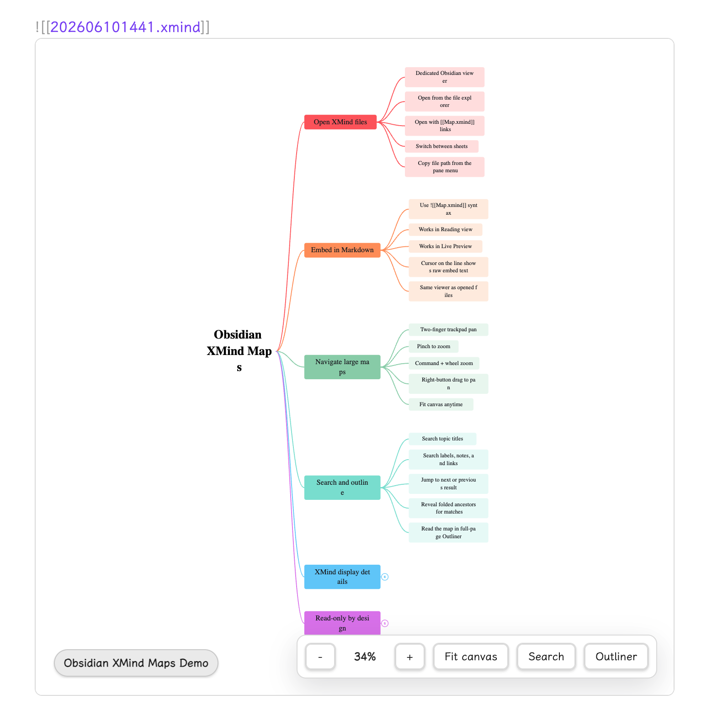
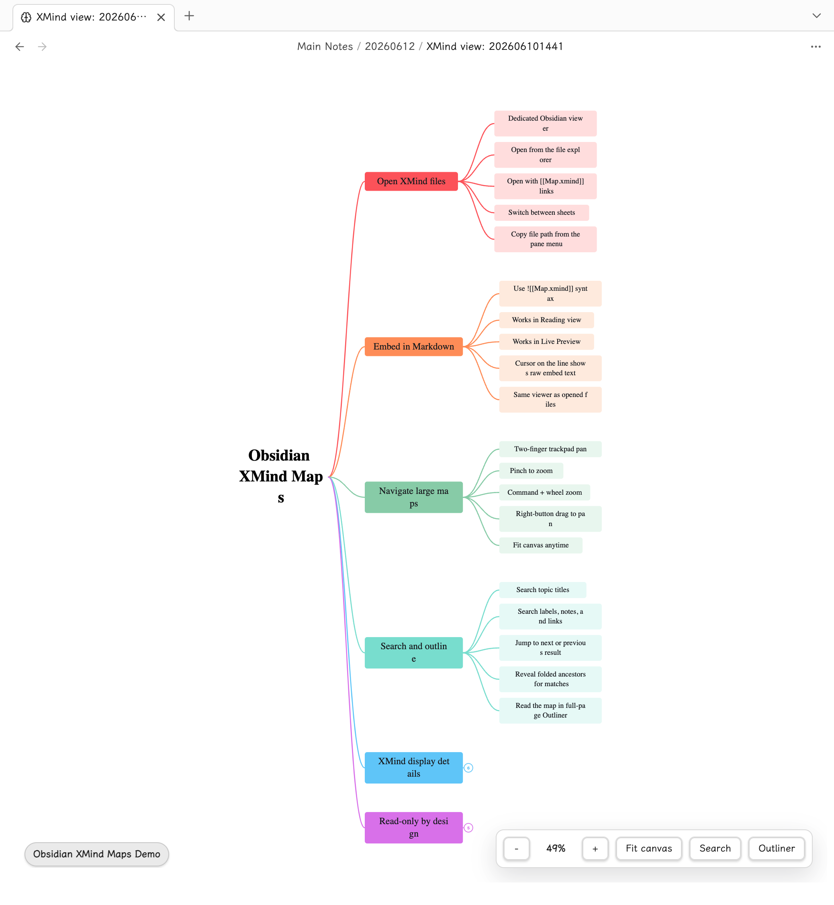

# XMind Maps

XMind Maps lets you open local `.xmind` files directly in Obsidian and embed them inside Markdown notes as a read-only viewer.

[简体中文](./README.zh-CN.md)

## Features

- Open `.xmind` files from your Obsidian vault in a dedicated XMind view.
- Embed `.xmind` files in Markdown notes with Obsidian syntax such as `![[Map.xmind]]`.
- Preview embedded mind maps in Reading view and Live Preview.
- Edit the raw `![[Map.xmind]]` embed text when your cursor is on that line in Live Preview.
- Switch between multiple sheets in the same XMind file.
- Search the current sheet and jump between matching topics.
- Use a full-page outliner view to read the map as a hierarchy.
- Zoom, fit the map to the pane, and pan around large maps.
- Use trackpad gestures, mouse wheel scrolling, `Command` + wheel zooming, and right-button dragging.
- Expand and collapse branches while respecting the folded state saved by XMind.
- View common XMind content such as relationships, boundaries, summaries, markers, labels, notes, links, tasks, images, callouts, floating topics, and topic shapes.
- Copy the file path from the Obsidian pane menu.
- Use English or Simplified Chinese UI text, following your Obsidian language when possible.

## Screenshots

Embedded inside a Markdown note:



Opened as a dedicated XMind file view:



## Installation

Install XMind Maps from Obsidian Community Plugins when it is available there.

For manual installation, download the release assets and place these three files in:

```text
<vault>/.obsidian/plugins/xmind-maps/
```

Required files:

- `main.js`
- `manifest.json`
- `styles.css`

Then open Obsidian settings, go to Community plugins, and enable XMind Maps.

## Usage

XMind Maps supports both opening `.xmind` files as Obsidian files and embedding them inside Markdown notes.

### Opening XMind Files

Put a `.xmind` file anywhere inside your Obsidian vault, then open it from the file explorer or a normal Obsidian link:

```markdown
[[Map.xmind]]
```

Obsidian will open the file in an XMind Maps view instead of a Markdown editor.

### Embedding In Notes

To embed a mind map in a Markdown note, use the normal Obsidian embed syntax:

```markdown
![[Map.xmind]]
```

The embedded viewer works in both Reading view and Live Preview. In Live Preview, XMind Maps behaves like Obsidian's native embeds: when your cursor is not on the embed line, you see the mind map; when your cursor moves onto that line, the raw `![[Map.xmind]]` text is shown so you can edit it.

Embedded maps use the same read-only viewer as opened files. XMind Maps does not edit, save, or write back to the original `.xmind` file.

## Viewer Controls

- `-` and `+`: zoom out or zoom in.
- Zoom percentage: shows the current zoom level.
- `Fit canvas`: fit the whole map into the current pane.
- `Search`: open the search panel for the current sheet.
- `Outliner`: switch to the full-page hierarchy view.
- Sheet tabs: switch between sheets when the XMind file contains more than one sheet.
- Two-finger scroll or mouse wheel: pan around the map.
- Trackpad pinch gesture: zoom the map.
- `Command` + mouse wheel: zoom the map.
- Hold the right mouse button and drag: pan the canvas.

## Branches

Branches that were collapsed in XMind open collapsed in XMind Maps, and expanded branches stay expanded.

- Click a numbered circle beside a topic to expand that hidden branch.
- Hover an expanded topic or its branch line to reveal the collapse control.
- Click the collapse control to fold that branch again.
- If a hidden count is larger than `999`, the control shows `...`.
- Manual expand and collapse changes only affect the current Obsidian viewing session.

## Search

Use `Search` to find content in the current sheet. Search covers topic titles, labels, notes, and links.

- Press `Enter` to jump to the next match.
- Press `Shift` + `Enter` to jump to the previous match.
- If a match is inside a folded branch, XMind Maps temporarily opens the needed ancestor branches in the current viewing session so the result is visible.

## Outliner

Use `Outliner` to switch from the canvas to a full-page outline view.

- The outliner follows the same initial expanded and collapsed state as the mind map.
- Click a disclosure arrow to expand or collapse a topic in the current viewing session.
- Folded topics show their hidden descendant count.
- Click a topic in the outliner to select and locate it on the map.

## XMind Content Display

XMind Maps focuses on viewing. It reads the local `.xmind` package and displays common XMind structures when they are present:

- Multiple sheets
- Folded branches
- Topic colors, text styles, shapes, and map backgrounds
- Relationships and relationship labels
- Boundaries and summaries
- Callouts and floating topics
- Markers, priorities, progress, tasks, labels, notes, and links
- Topic images and basic attachment, equation, or audio indicators

Some advanced theme details may still differ from the XMind desktop app. The original `.xmind` file is never modified.

## Pane Menu

Use the three-dot pane menu in Obsidian to copy the path of the current `.xmind` file.

Depending on your Obsidian version, `Copy path` may include:

- `as Obsidian URL`
- `from vault folder`
- `from system root`

## Notes

- XMind Maps is read-only and does not edit, save, or export XMind files.
- Opening or embedding a mind map will not modify the original `.xmind` file.
- Viewer state such as zoom, pan, search, outliner mode, and manual branch expand/collapse is kept only for the current viewing session.
- Visual details may not match every XMind desktop or web theme exactly.
- If a file does not open, confirm it is a valid `.xmind` file and try opening it again from the Obsidian file explorer.

## License

Apache-2.0. Copyright 2026 yuanzhixiang.
